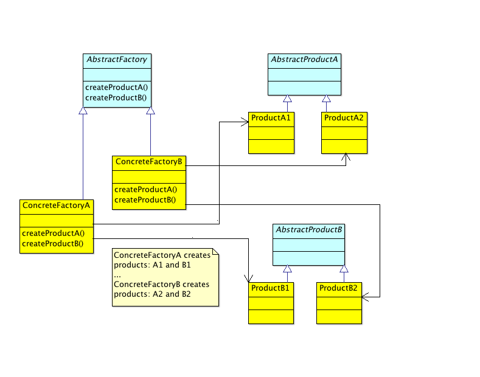

# Factory Pattern

## Overview

In this chapter, we will discuss object creation, and specifically, how you can use factories to encapsulate such creational responsibilities. You'll see that instantiation is a rather volatile affair that should be compartmentalized before it gets "out of control". But before we dive in to factory patterns, let's revisit some prerequisite object-oriented principles.

**Encapsulate what varies**

Any portion of code that instantiates a new object is taking on a creational responsibility; and further becomes coupled to the type being instantiated. This defeats our goal to create classes that are cohesive units that do "one thing well". Even more insidious is the fact that there's no guarantee what new objects we'll need tomorrow...today we need an Oracle connection, tomorrow a MySQL connection...today we're sending Email messages, tomorrow RSS feeds...and so on. We've already learned that we should encapsulate areas likely to change—and creational code, as we've seen, is always likely to change.

**Dependency Inversion Principle**

If you recall from our object-oriented chapter, we discussed the S.O.L.I.D. principles which included the _Dependency Inversion Principle_. Let's dig a bit deeper into that principle which states that:

A. High-level modules should not depend on low-level modules. Both should depend on abstractions.

B. Abstractions should not depend upon details. Details should depend upon abstractions.

What are high and low level modules? High-level modules deal with larger sets of functionality, whereas lower level modules deal with more detailed operations. For example, a module that generates SQL, connects to a Database, and then executes that SQL's query, would be a low-level module. A related, but higher-level module, might be a Persistance class responsible for allowing general data persistence. While it may use the aforementioned low-level database module to write to the database, it may also work with other low-level modules like an I/O module for writing to files, a Console module for writing to standard output, and so on. So, if in this example, our Persistance class directly creates instances of any of the lower-level classes (DB, I/O, Console, etc.), it breaks the Dependency Inversion Principle since instantiation causes a direct dependency.

Let's make this all a bit more concrete with another example. Assume you have a Messenger module that's in charge of sending things. Perhaps your first set of requirements state that the Messenger need only send via the post office ("snail mail"):

```java
class Messenger {
	private SnailMail mail;
	public Messenger () {
		mail = new SnailMail();
	}
	public void send(String destination, Package package) {
		mail.send(String destination, Package package);
	}
}	
class SnailMail {
	public void send(String destination, Package package) {
		System.out.println("Postal service sending package");
	}
}
```

The key violation of DIP above is the 'mail' property of type SnailMail. Since Messenger is a high level module, and it now depends on the SnailMail module, DIP has been violated. We can see why this violation matters if we imagine that tomorrow our Messenger needs to additionally support a Fedex sender. Having a crazy deadline to meet we nervously code up the following:

```java
class Messenger {
	private SnailMail mail;
	private Fedex fedex;
	public enum Speed {FAST, SLOW};

	public void send(Speed speed,
			String destination, Package package)
	{
		if (speed == Speed.FAST) {
			this.fedex = new Fedex();
			this.fedex.send(String destination, Package package);
		} else {
			this.mail = new SnailMail();
			this.mail.send(String destination, Package package);
		}
	}
}	
```

Hopefully, you find this code objectionable! We now have the following unfortunate code smells:

* the unfortunate addition of the 'speed' enum property
* extra type-based fields making code harder to read 

The rather inprecise 'speed' property will be problematic when we add senders that send things at approximately the same speed, or have new speeds requiring us to add new enum values.

Also, what happens next week when we decide to support international mail and have opportunities to add new carriers? We'll have to directly modify the conditional code adding these carriers (and we'll be breaking the open/closed principle since we'll have to modify our class directly!) 

So how can we solve these sorts of problems without breaking DIP? Let's see how the Factory Method might help to circumnavigate such issues.

## Factory Method


The factory method is a creational design pattern that allows you to encapsulate the creation of concrete types by defining an abstraction through which objects are created:

> "Define an interface for creating an object, but let subclasses decide which class to instantiate. Factory Method lets a class defer instantiation to subclasses."—[Gang of Four][gof]

 

As we'll see shortly, the Factory Method has two main variants, one using sub-classing, the other a parameterized factory method. We'll start out looking at the sub-classing variant which is implemented as follows:

* _Product_ defines the interface for products
* _ConcreteProduct_ implements the product interface
* An abstract class _Creator_ defines a factory method, which creates and returns a _Product_
* A ConcreteCreator overrides the factory method to return actual instances of a _ConcreteProduct_

Let's toss our earlier Messenger code and try implementing a _Sender_ that's created using the Factory Method pattern. We'll start with a test that ensures that we can generate an appropriate sender via its corresponding factory:

```php

<?php
// ... code intentionally omitted
	public function testFactoryBegetsProduct() {
		$fedexFactory = new FedexFactory();
		$fedexProduct = $fedexFactory->createSender();
		$this->assertInstanceOf('FedexSender', $fedexProduct,
			"Should get correct sender from factory");
		$this->assertEquals(SenderTypes::Fedex, $fedexProduct->getType(),
			"Should be able to call sender's operations");
	}
// ... code intentionally omitted
?>
```

The test above simply confirms that a "Fedex Factory" should be able to generate a "Fedex Sender" product. Here's the implemention...

```php
<?php

// Factories
interface Factory {
	public function createSender();
}
class FedexFactory implements Factory {
	public function createSender() {
		return new FedexSender(); 
	}
}
class SnailMailFactory implements Factory {
	public function createSender() {
		return new SnailMailSender(); 
	}
}
class AramexFactory implements Factory {
	public function createSender() {
		return new AramexSender(); 
	}
}

// Products 
class SenderTypes {
    const SnailMail = 0;
    const Fedex = 1;
    const Aramex = 2;
}
interface Sender {
	public function send($destination, $package);
	public function getType();
}
class FedexSender implements Sender {
	public function send($destination, $package) {
		echo ("Fedex sending...\n");
	}
	public function getType() {
		return SenderTypes::Fedex;
	}
}
class SnailMailSender implements Sender {
	public function send($destination, $package) {
		echo ("Snail mail sending...\n");
	}
	public function getType() {
		return SenderTypes::SnailMail;
	}
}
class AramexSender implements Sender {
	public function send($destination, $package) {
		echo ("Aramex sending international...\n");
	}
	public function getType() {
		return SenderTypes::Aramex;
	}
}

?>

```

With the above code in place, our messenger no longer needs to worry about which type of sender it's working with; that burden becomes the client's. For example, if a client wanted to send a package via Fedex it would simply do: 

```java
$fedexFactory = new FedexFactory();
$sender = $fedexFactory->createSender();
$sender->send($someDestination, $somePackage);
```

While the client _does_ have to instantiate the factory itself, the product gets created "behind the scenes", and is therefore encapsulated.

### Factory Method Variations

We mentioned earlier that there are two main variations of Factory Method:

* The sub-class approach

The Factory Method is defined in a base abstract class or interface (the Creator), and then overriden by concrete sub-classes (see the above Sender example).

* Parameterized Factory Method approach

In this version, there is generally just one Creator who's factory method takes a "type" parameter which is used to determine which type to of object create:

```php
<?php
// ... code intentionally omitted
class SenderFactory {
	public function createSender($type) {
		$sender = null;

		if ($type == SenderTypes::Fedex) {
			$sender = new FedexSender();
		} else if ($type == SenderTypes::Snail) {
			$sender = new SnailMailSender();
		} else if ($type == SenderTypes::Aramex) {
			$sender = new AramexSender();
		} else {
			// An arbitrary default might be snail mail
			$sender = new SnailMailSender();
		}
		return $sender;
	}
}
?>
```

The above conditional would appear to be a flagrant abuse of open/closed principle (as you'll have to directly modify the SenderFactory as soon as you need to add a new sender type). On the other hand, it might be more straightforward (since we don't need to create sub-classes). In any event, both variants give us the benefit of _encapsulating that which varies_.

### Pitfalls

#### Layers of indirection:

The sub-class variant requires us to create an inheritance hierarchy which adds some complexity.

#### Conditional code:

In the parameterized factory method variant we end up with ugly conditional code that violates open/closed principle.

#### Complicated:

Using a constructor to create a new object is immediately understandable, whereas, a factory method might not be. This might be helped by standardizing on factory naming conventions throughout your code base.

## Abstract Factory

The [GoF][gof] definition for Abstract Factory states that it:

> Provides an interface for creating families of related or dependent objects without specifying their concrete classes.


 

* AbstractFactory defines the interface for product creation
* ConcreteFactory creates the concrete products
* AbstractProduct defines the interface for the product
* ConcreteProduct defines the concrete product objects themselves

_It is easy to get confused when trying to diffrentiate the Factory Method and the Abstract Factory; especially, since the Abstract Factory may, in fact, use the Factory Method in its implementation! Try to remember that the primary intent of the Abstract Factory pattern is to allow us to return "familes of related objects"._

We're going to use the Abstract Factory pattern to model a car factory which allows us to create families of car products. In order to keep things easier to follow, we'll only worry about creating the engine and passenger compartment components.

Let's start with some tests. We want to know that when we use a particular concrete factory, we can, in turn, receive the correct corresponding concrete component:

```php

<?php
// ... code intentionally omitted

	// Abstract Factory - Tests
	public function testFactoriesGetCorrectStandardEnginePart() {
		$standardCarFactory = new StandardCarPartsFactory();
		$this->assertInstanceOf('CombustionEngine',
				$standardCarFactory->createEngine(),
				"Standard gets correct CombustionEngine");
	}
	public function testFactoriesGetCorrectMuscleEnginePart() {
		$muscleCarFactory = new MuscleCarPartsFactory();
		$this->assertInstanceOf('V8Engine',
				$muscleCarFactory->createEngine(),
				"Muscle gets correct V8Engine");
	}
	public function testFactoriesGetCorrectHybridEnginePart() {
		$hybridCarFactory = new HybridCarPartsFactory();
		$this->assertInstanceOf('HybridEngine',
				$hybridCarFactory->createEngine(),
				"Hybrid car gets correct HybridEngine");
	}
	public function testGetCorrectStandardPassengerCompartment() {
		$standardCarFactory = new StandardCarPartsFactory();
		$this->assertInstanceOf('StandardPassengerCompartment',
				$standardCarFactory->createPassengerCompartment(),
				"Standard gets correct StandardPassengerCompartment");
	}
	public function testGetCorrectMusclePassengerCompartment() {
		$muscleCarFactory = new MuscleCarPartsFactory();
		$this->assertInstanceOf('MusclePassengerCompartment',
				$muscleCarFactory->createPassengerCompartment(),
				"Muscle car gets correct MusclePassengerCompartment");
	}
	public function testGetCorrectHybridPassengerCompartment() {
		$hybridCarFactory = new HybridCarPartsFactory();
		$this->assertInstanceOf('HybridPassengerCompartment',
				$hybridCarFactory->createPassengerCompartment(),
				"Hybrid car gets correct HybridPassengerCompartment");
	}
?>
```

And here's the implementation.


```php
<?php

abstract class CarPartsFactory {
	abstract public function createEngine();
	abstract public function createPassengerCompartment();
	// ... Doors, Wheels, etc., etc.
}

class StandardCarPartsFactory extends CarPartsFactory {
	public function createEngine() {
		return new CombustionEngine();
	}
	public function createPassengerCompartment() {
		return new StandardPassengerCompartment();
	}
}

class MuscleCarPartsFactory extends CarPartsFactory {
	public function createEngine() {
		return new V8Engine();
	}
	public function createPassengerCompartment() {
		return new MusclePassengerCompartment();
	}
}

class HybridCarPartsFactory extends CarPartsFactory {
	public function createEngine() {
		return new HybridEngine();
	}
	public function createPassengerCompartment() {
		return new HybridPassengerCompartment();
	}
}

interface Engine {
	public function start();
	public function stop();
	public function accelerate();
}

class HybridEngine implements Engine {
	public function start() {
		echo "Starting hybrid engine\n";
	}
	public function stop() {
		echo "Stopping hybrid engine\n";
	}
	public function accelerate() {
		echo "Accelerating hybrid engine\n";
	}
} 

class V8Engine implements Engine {
	public function start() {
		echo "Starting V8 engine\n";
	}
	public function stop() {
		echo "Stopping V8 engine\n";
	}
	public function accelerate() {
		echo "Accelerating V8 engine\n";
	}
} 

class CombustionEngine implements Engine {
	public function start() {
		echo "Starting Combustion engine\n";
	}
	public function stop() {
		echo "Stopping Combustion engine\n";
	}
	public function accelerate() {
		echo "Accelerating Combustion engine\n";
	}
} 

interface PassengerCompartment {}
class StandardPassengerCompartment implements PassengerCompartment {}
class HybridPassengerCompartment implements PassengerCompartment {}
class MusclePassengerCompartment implements PassengerCompartment {}
?>
```

With the above in place, client code can simply instantiate the desired factory, and then use that instance to create the parts as needed:

```php
$factory = new MuscleCarPartsFactory();
$this->engine = $factory->createEngine(); 
$this->interior = $factory->createPassengerCompartment();
// ... and so on
```

An alternative is create a 'product' class that uses the factory to generate a _fully built product_. In the following we create a Car class that takes a parts factory in its constructor, and then, essentially, builds itself:

```php
<?php
class Car {
	protected $engine = null;
	protected $passengerCompartment = null;

	public function __construct(CarPartsFactory $partsFactory) {
		$this->engine = $partsFactory->createEngine();	
		$this->passengerCompartment = 
			$partsFactory->createPassengerCompartment();
	}
	public function start() {
		$this->engine->start();
	}
	public function stop() {
		$this->engine->stop();
	}
	public function accelerate() {
		$this->engine->accelerate();
	}
	protected function __ensureBuilt() {
		if ($this->engine == null) {
			$this->build();
		}
	}
	public function getEngine() {
		return $this->engine;
	}
	public function getPassengerCompartment() {
		return $this->passengerCompartment;
	}
}
?>
```

_Allowing a Car class to essentially build itself, does add a creational responsibility to Car; but given that all objects that implement a constructor are, in essence, intializing themselves, we'd argue this hasn't really weakened cohesion._

In this arrangement, we have the Car's constructor taking the CarPartsFactory in its constructor (letting clients be burdened with deciding which type of car parts factory to use). This is called [Dependency Injection][di_demystified]. Please do not confuse _injection_ with _inversion_ as it's so easy to do (see [Dependency Injection Is NOT The Same As The Dependency Inversion Principle][injection_not_inversion]).

By allowing client code to inject the "depended on component" ([DOC][doc]), we are afforded more flexibility in our tests (since our tests can create these depended on components and "pass them in"):

```php
<?php
	public function testCarPartsFactoryCreateEngineCalled() {
		$hybridEngine = new HybridEngine();
        $factoryStub = $this->getMock('HybridCarPartsFactory');
        $factoryStub->expects($this->once())
        	 ->method('createEngine')
        	 ->will($this->returnValue($hybridEngine));
        // Here we "inject" Car with a factory
		$car = new Car($factoryStub);
		$car->start();
    }
// ... code intentionally omitted
?>
```

In the above test, we are able to create a [mock object][mock_objects], which takes place of the hybrid factory, and confirm that it in fact gets called from within the Car's constructor.


### Pitfalls

#### Adding new components:

The biggest issue with the Abstract Factory is that anytime you want to add an additional component, you will have to modify your factory and component code as such. For example, if we add a 'createWheels' method, look at the hoops we must jump through:

* Add the new wheels component:
	* Add new abstract wheel product
	* Add new wheel implementation
* Add a 'createWheels' to our abstract factory
* Add a 'createWheels' to _all_ derived concrete factories: StandardCarPartsFactory, HybridCarPartsFactory, MuscleCarPartsFactory

This is tedious at best. Also, since we're having to reopen our code, we cannot assert conformance to the open/closed principle.

#### Complexity: 

Perhaps your reaction to the Car example above was, "Wow, that's a lot of code there!". We'd agree, and this is arguably another disadvantage of the Abstract Factory—the sheer number of classes involved. Imagine how complicated things will become when we start adding all the common car components you'd expect like the transmission, drive train, break system, wheels, doors, etc.


## Static Factory

There is another way in which we may supply factory-like functionality which is not an official design pattern per se, but useful all the same. Joshua Bloch calls it a _static factory method_. In [Effective Java][effective_java], he describes this as simply:

> a static method that returns an instance of the class.

He goes on to provide some advantages of static factories:

* they have descriptive names, unlike constructors
* whereas a class can only have a single constructor with a given signature, you can have as many static factories as needed
* they don't have to create new objects each time called
* they can return subtypes

He goes on to provide an example of how a _service provider framework_ might supply a mechanism for registering alternative implementations via a well-known _properties file_ (similar to what [the Pragmatic Programmers][tpp] might call a _metadata-driven approach_). Using this metadata-driven approach, a client passes in a key to the provider framework's static factory method, which is then used to look up and instantiate the appropriate class. The following is a variation on this theme:

```php
<?php
// ... code intentionally omitted

	// Tests
	public function testGetDefinedInstance() {
		$returnedInstance = ProviderFramework::getInstance("moduleA");
		$this->assertInstanceOf('ModuleA', $returnedInstance,
			"Should get the correct instance");
	}

	public function testGetUndefinedInstanceReturnsDefault() {
		$returnedInstance = ProviderFramework::getInstance("bogus");
		$this->assertInstanceOf('DefaultModule', $returnedInstance,
			"Should fall back to a default instance if undefined key");
	}

// ... code intentionally omitted

// Provider Framework - Implementation
class Metadata {
	public function getModules() {
		// Let's imagine that in a "real system" we'd be getting
		// these from a known metadata configuration file.
		return array( 
			"moduleA" => "ModuleA",
			"moduleB" => "ModuleB",
		);
	}	
}

class DefaultModule {
}
class ModuleA {
}
class ModuleB {
}

class ProviderFramework {
	private static $modules = null;

	private static function initMetadata() {
		if (self::$modules == null) {
			$meta = new Metadata();
			self::$modules = $meta->getModules();
		}
	}
	
	public static function getInstance($key) {
		self::initMetadata();
		if (!isset(self::$modules[$key])) {
			return new DefaultModule();
		}
		$klass = self::$modules[$key];
		return new $klass();
	}
	public static function reset() {
		self::$modules = null;
	}
}

?>
```

### Pitfalls

Some disadvantages of the static factory approach are:

* we cannot subclass (due to the private constructor)
* they're not distinguishable from other static methods

## Final Thoughts

In this chapter we've presented three patterns to help aid in object creation (well, actually two patterns and one idiom—_static factory_ isn't really an "official pattern"). These patterns can help you to maintain cohesion in your modules, pushing any creational responsibility to encapsulated factories. 


