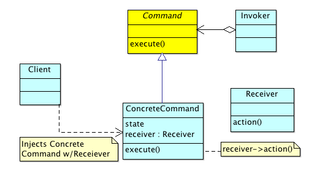

# Command Pattern

 

## Overview

The Command pattern is used to:

> "Encapsulate a request as an object, thereby letting you parameterize clients with different requests, queue or log requests, and support undoable operations."—[Gang of Four][gof]

Command is a behavioural pattern that decouples objects that invoke behaviour from objects that actually carry out those behaviours. Appropriately, we have an _Invoker_ object that requests some behaviour, and a _Receiver_ object that actually carries out that behaviour.

In the case of the Command pattern, however, the Invoker does not know nor communicate with the receiver directly—instead, it calls a Command object's _execute_ method, which takes care of invoking the receiver; the receiever then carries out the desired behaviour.

The command object is what decouples the invoker and receiver objects and provides the following benefits:

* The invoker needn't know about the receiever's interface

* The behavior may be carried out asynchronously

The defining characteristics of the command object are:

* an _execute_ operation

* a reference to a _Receiver_ that has code to fulfil the request

There are variations of command pattern that add functionality like _undo_ and _batch commands_. We will look at some of these later in this chapter.

### Implementation


 


The above sequence diagram should be fairly self-evident:

* a Client creates a Command Object, injecting it with a Receiever
* the Client stores this "command object" on the Invoker 
* some period of time elapses
* the Invoker calls _execute_ on the Command Object
* the Command Object, in turn, calls _action_ on the Receiever

### The "Very Simplest" Command Pattern Implementation

Before we do something useful with the Command pattern, let's first create a "vanilla" Command implementation. As we've described, the core collaborations happen when the Invoker decides to trigger the Command's _execute_ or _undo_ method. Let's _Mock_ the Receiver object and simply ensure that its appropriate operations get called:


```java

import static org.junit.Assert.*;

import org.junit.After;
import org.junit.Before;
import org.junit.Test;

// http://docs.mockito.googlecode.com/hg/org/mockito/Mockito.html
import static org.mockito.Mockito.*;

public class CommandTests {

	private Invoker invoker;
	private Receiver mockReceiver;
	private Command command;

	@Before
	public void setUp() throws Exception {
		this.mockReceiver = mock(Receiver.class);
		this.command = new ConcreteCommand(this.mockReceiver);
		this.invoker = new Invoker();
		this.invoker.setCommand(this.command);
	}

	@After
	public void tearDown() throws Exception {
		this.command = null;
		this.invoker = null;
		this.mockReceiver = null;
	}

	@Test
	public void testCommandCallsReceiver() {
		// Test acting as "client" for now
		this.invoker.action();
		verify(this.mockReceiver, times(1)).doSomething();
	}
	
	@Test
	public void testUndo() {
		this.invoker.undo();
		verify(this.mockReceiver, times(1)).undoSomething();
	}

}
```

The above tests are _code smells_ since there's no clear _system under test_ (we're asserting the our Receiver mock gets called as the result of invoking the Invoker; but Invoker, in turn, depends on ConcreteCommand. Generally, we should not mock dependents more then one level deep). Since our tests are merely acting as a confirmation that the pattern is working as we expect, we won't bother refactoring. The tests pass with the following implementation:

```java

public interface Command {
	public void execute();
	public void undo();
}

public class ConcreteCommand implements Command {
	private Receiver receiver;
	
	public ConcreteCommand(Receiver receiver) {
		this.receiver = receiver;
	}
	@Override
	public void execute() {
		this.receiver.doSomething();
	}

	@Override
	public void undo() {
		this.receiver.undoSomething();
	}
}

public class Receiver {
	public void doSomething() {
		System.out.println("Doing something useful...");
	}
	public void undoSomething() {
		System.out.println("Undoing 'something useful'...");
	}
}

public class Invoker {
	private Command command = null;
	
	public void setCommand(Command command) {
		this.command = command;
	}
	public void action() {
		if (this.command != null) {
			command.execute();
		}
	}
	public void undo() {
		if (this.command != null) {
			command.undo();
		}
	}
}
```

Reading the above code, it should be clear the path that the code takes when Invoker's _action_ is called; the Concrete Command's _execute_ is called, which in turn, calls the Receiver's _doSomething_ method. The code path for _undoing_ is equally simple. This is a purposely pedentic example, but does show the general collaborations between the Invoker, Command, and Receiver objects. 

### Naming Conventions

One of the difficulties we're presented with when trying to use design patterns, is how to map the names of a pattern's collaborating objects to those in the system we're trying to build. Should we incorporate the pattern being used as a suffix (e.g. MyFooInvoker, and MyBarReceiver, etc.)? Although this does have the advantage of indicating the pattern objects being used, it may start to look like a form of _Hungarian Notation_. The real question, however, is whether the resulting name properly describes the thing it represents. In some cases, the suffix approach might work; we could have Command objects named DogSitCommand and DogSpeakCommand. These actually do represent the thing being modelled (while still including the pattern object as a suffix). 

As [Code Complete 2][code_complete2] advocates, we should strive to describe only the thing being represented itself:

> Does the name fully and accurately describe what the variable represents? ... Names should be specific as possible. Names that are vague enough or general enough to be used for more than one purpose are usually bad names.

The take away (in our opinion) is, to remain flexible, but use your judgement as to whether the suffix approach will detract from a good variable name or not. 

## Example: A user interface toolkit 

The quintessential problem that lends itself to the Command Pattern is a _user interface toolkit_. For example, the toolkit might have widgets that a user interacts with like menu items, toolbar items, keyboard shortcuts, etc., that trigger certain actions. Let's try to implement a subset of such a system.

### Designing "on the go"

We need to take a couple of minutes to figure out how we're going to map our GUI's objects to those defined in the Command Pattern. We can use a sort of "watered down" [pseudocode programming process][ppp] approach to come up with something like the following:

```java
	@Test
	public void testGUIImplementationOfCommandPattern() {
		// 1. Instantiate a document "Receiver"
			// We'll call ours: DocumentOperations
			// open, close, cut, paste, etc.
		// 2. Then add menu items (Commands):
			// MenuItemOpen, MenuItemClosed, etc.
			// ToolBarItemOpen, ToolBarItemClosed, etc.
		// 3. UIEventsManager will act as our "Invoker". We'll support:
			// handleMenuPressEvent 
			// handleUndoMenuPressEvent
			// handleToolBarPressEvent
			// handleUndoToolBarPressEvent
			// ... etc.
	}
```

If we were using PPP formally, we'd put these sorts of comments in a production method, and then replace each section with actual implementation code. But, in this case, we were actually sitting inside our first test case, looking for a way to quickly get our thoughts down; this type of bastardized PPP works fine for that purpose (yes, pencil and paper would work as well). 

As you can see, we've decided that our _Receiver_ will be a DocumentOperations class, and support open, close, cut, paste, etc.; our _Concrete Commands_ will be MenuItemOpen, MenuItemClose, ToolBarItemOpen, ToolBarItemClosed, etc.; and our _Invoker_ will be the UIEventsManager (in a real system we'd likely separate this one into more classes as it's taking on too many responsibilities; but for this example, we'll overlook this shortcoming); this will provide the corresponding event registration and handling, etc.

### Implementation 

Ok, so we have a basic sketch of our design. Let's implement this thing! For brevity's sake, we'll just implement the open, close, cut, and paste operations.

First, here are the tests for the GUI application:

```java

import static org.junit.Assert.*;
import org.junit.After;
import org.junit.Before;
import org.junit.Test;

//http://docs.mockito.googlecode.com/hg/org/mockito/Mockito.html
import static org.mockito.Mockito.*;

public class GUITests {
	
	private ICommand mockMenuOpenCommand;
	private ICommand mockMenuCloseCommand;
	private ICommand mockMenuCut;
	private ICommand mockMenuPaste;
	
	private ToolBarItemOpen mockToolbarOpenCommand;
	private ToolBarItemClose mockToolbarCloseCommand;
	private ToolBarItemCut mockToolbarCut;
	private ToolBarItemPaste mockToolbarPaste;
	
	private UIEventsManager eventManager;
	private DocumentOperations mockDocumentOperations;

	@Before
	public void setUp() {
		mockMenuOpenCommand = mock(MenuItemOpen.class);
		mockMenuCloseCommand = mock(MenuItemClose.class);
		mockMenuCut = mock(MenuItemCut.class);
		mockMenuPaste = mock(MenuItemPaste.class);
		mockToolbarOpenCommand = mock(ToolBarItemOpen.class);
		mockToolbarCloseCommand = mock(ToolBarItemClose.class);
		mockToolbarCut = mock(ToolBarItemCut.class);
		mockToolbarPaste = mock(ToolBarItemPaste.class);
		mockDocumentOperations = mock(DocumentOperations.class);
		eventManager = new UIEventsManager();
	}
	
	@After
	public void tearDown() {
		mockMenuOpenCommand = null;
		mockMenuCloseCommand = null;
		mockMenuCut = null;
		mockMenuPaste = null;
		mockToolbarOpenCommand = null;
		mockToolbarCloseCommand = null;
		mockToolbarCut = null;
		mockToolbarPaste = null;
		mockDocumentOperations = null;
		eventManager = null;
	}
	
	@Test
	public void testDocumentOperationsReceiverCalledForMenuOpen() {
		ICommand menuOpenCommand = 
			new MenuItemOpen(mockDocumentOperations, "foofile.txt");
		menuOpenCommand.execute();
		verify(mockDocumentOperations, times(1)).open("foofile.txt");
	}
		
	@Test
	public void testDocumentOperationsReceiverCalledForToolbarOpen() {
		ICommand toolbarOpenCommand =
			new ToolBarItemOpen(mockDocumentOperations, "foo2file.txt");
		toolbarOpenCommand.execute();
		verify(mockDocumentOperations, times(1)).open("foo2file.txt");
	}
	
	@Test
	public void testDocumentOperationsReceiverCalledForMenuClose() {
		ICommand menuCloseCommand =
			new MenuItemClose(mockDocumentOperations, "foofile.txt");
		menuCloseCommand.execute();
		verify(mockDocumentOperations, times(1)).close("foofile.txt");
	}
	
	@Test
	public void testDocumentOperationsReceiverCalledForToolbarClose() {
		ICommand toolbarCloseCommand =
			new ToolBarItemClose(mockDocumentOperations, "foo2file.txt");
		toolbarCloseCommand.execute();
		verify(mockDocumentOperations, times(1)).close("foo2file.txt");
	}
	
	@Test
	public void testDocumentOperationsReceiverCalledForMenuCut() {
		ICommand menuCutCommand =
			new MenuItemCut(mockDocumentOperations);
		menuCutCommand.execute();
		verify(mockDocumentOperations, times(1)).cut();
	}
	
	@Test
	public void testDocumentOperationsReceiverCalledForToolbarCut() {
		ICommand toolbarCutCommand =
			new ToolBarItemCut(mockDocumentOperations);
		toolbarCutCommand.execute();
		verify(mockDocumentOperations, times(1)).cut();
	}
	
	@Test
	public void testDocumentOperationsReceiverCalledForMenuPaste() {
		ICommand menuPasteCommand = 
			new MenuItemPaste(mockDocumentOperations);
		menuPasteCommand.execute();
		verify(mockDocumentOperations, times(1)).paste();
		menuPasteCommand.undo();
		verify(mockDocumentOperations, times(1)).undoPaste();
	}
	
	@Test
	public void testDocumentOperationsReceiverCalledForToolbarPaste() {
		ICommand toolbarPasteCommand =
			new ToolBarItemPaste(mockDocumentOperations);
		toolbarPasteCommand.execute();
		verify(mockDocumentOperations, times(1)).paste();
		toolbarPasteCommand.undo();
		verify(mockDocumentOperations, times(1)).undoPaste();
	}
	
	@Test
	public void testInvokerInvokesMenuOpenConcreteCommand() {
		eventManager.addMenuCommand("open", mockMenuOpenCommand);
		eventManager.handleMenuPressEvent("open");
		verify(mockMenuOpenCommand, times(1)).execute();
	}
	
	@Test
	public void testInvokerInvokesToolbarOpenConcreteCommand() {
		eventManager.addMenuCommand("open", mockToolbarOpenCommand);
		eventManager.handleMenuPressEvent("open");
		verify(mockToolbarOpenCommand, times(1)).execute();
	}
	
	@Test
	public void testInvokerInvokesMenuClosedConcreteCommand() {
		eventManager.addMenuCommand("close", mockMenuCloseCommand);
		eventManager.handleMenuPressEvent("close");
		verify(mockMenuCloseCommand, times(1)).execute();
	}
	
	@Test
	public void testInvokerInvokesToolbarClosedConcreteCommand() {
		eventManager.addMenuCommand("close", mockToolbarCloseCommand);
		eventManager.handleMenuPressEvent("close");
		verify(mockToolbarCloseCommand, times(1)).execute();
	}
	
	@Test
	public void testInvokerInvokesMenuCut() {
		eventManager.addMenuCommand("cut", mockMenuCut);
		eventManager.handleMenuPressEvent("cut");
		verify(mockMenuCut, times(1)).execute();
	}
	
	@Test
	public void testInvokerInvokesToolbarCut() {
		eventManager.addMenuCommand("cut", mockToolbarCut);
		eventManager.handleMenuPressEvent("cut");
		verify(mockToolbarCut, times(1)).execute();
	}
	
	@Test
	public void testInvokerInvokesMenuPaste() {
		eventManager.addMenuCommand("paste", mockMenuPaste);
		eventManager.handleMenuPressEvent("paste");
		verify(mockMenuPaste, times(1)).execute();
	}
	
	@Test
	public void testInvokerInvokesToolbarPaste() {
		eventManager.addMenuCommand("paste", mockToolbarPaste);
		eventManager.handleMenuPressEvent("paste");
		verify(mockToolbarPaste, times(1)).execute();
	}
}

```

And here are the various implementation files for the GUI system:

```java

// IDocumentOperations acts as a "Receiver" (Command Pattern)
public interface IDocumentOperations {
	public void open(String fileName);
	public void close(String fileName);
	public void cut();
	public void undoPaste();
	public void paste();
}

public class DocumentOperations implements IDocumentOperations {

	public void open(String fileName) {
		System.out.println("Opening " + fileName + "...");
	}

	public void close(String fileName) {
		System.out.println("Closing " + fileName + "...");
	}

	@Override
	public void cut() {
		System.out.println("Cutting some text...");
	}

	@Override
	public void paste() {
		System.out.println("Pasting some text...");
	}
	
	@Override
	public void undoPaste() {
		System.out.println("Undoing last paste operation...");
	}
}

public interface ICommand {
	public void execute();
	public void undo();
}

// MenuItemOpen acts as a "ConcreteCommand" (Command Pattern)
public class MenuItemOpen implements ICommand {

	private IDocumentOperations documentOperations;
	private String fileName;
	
	public MenuItemOpen(IDocumentOperations documentOperations, String fileName) {
		this.documentOperations = documentOperations;
		this.fileName = fileName;
	}

	@Override
	public void execute() {
		this.documentOperations.open(this.fileName);
	}

	@Override
	public void undo() {} // NOP

}

//MenuItemClosed acts as a "ConcreteCommand" (Command Pattern)
public class MenuItemClose implements ICommand {
	private IDocumentOperations documentOperations;
	private String fileName;
	
	public MenuItemClose(IDocumentOperations documentOperations, String fileName) {
		this.documentOperations = documentOperations;
		this.fileName = fileName;
	}

	@Override
	public void execute() {
		this.documentOperations.close(this.fileName);
	}

	@Override
	public void undo() {} //NOP

}

public class MenuItemCut implements ICommand {
	private IDocumentOperations documentOperations;
	
	public MenuItemCut(IDocumentOperations documentOperations) {
		this.documentOperations = documentOperations;
	}

	@Override
	public void execute() {
		this.documentOperations.cut();
	}

	@Override
	public void undo() {} //NOP
}

public class MenuItemPaste implements ICommand {

	private IDocumentOperations documentOperations;
	
	public MenuItemPaste(IDocumentOperations documentOperations) {
		this.documentOperations = documentOperations;
	}

	@Override
	public void execute() {
		this.documentOperations.paste();
	}

	@Override
	public void undo() {
		this.documentOperations.undoPaste();
	}

}

public class ToolBarItemOpen implements ICommand {

	private IDocumentOperations documentOperations;
	private String fileName;
	
	public ToolBarItemOpen(IDocumentOperations documentOperations, String fileName) {
		this.documentOperations = documentOperations;
		this.fileName = fileName;
	}

	@Override
	public void execute() {
		this.documentOperations.open(this.fileName);
	}

	@Override
	public void undo() {} // NOP

}

public class ToolBarItemClose implements ICommand {
	private IDocumentOperations documentOperations;
	private String fileName;
	
	public ToolBarItemClose(IDocumentOperations documentOperations, String fileName) {
		this.documentOperations = documentOperations;
		this.fileName = fileName;
	}

	@Override
	public void execute() {
		this.documentOperations.close(this.fileName);
	}

	@Override
	public void undo() {} //NOP

}

public class ToolBarItemCut implements ICommand {
	private IDocumentOperations documentOperations;
	
	public ToolBarItemCut(IDocumentOperations documentOperations) {
		this.documentOperations = documentOperations;
	}

	@Override
	public void execute() {
		this.documentOperations.cut();
	}

	@Override
	public void undo() {} //NOP
}

public class ToolBarItemPaste implements ICommand {

	private IDocumentOperations documentOperations;
	
	public ToolBarItemPaste(IDocumentOperations documentOperations) {
		this.documentOperations = documentOperations;
	}

	@Override
	public void execute() {
		this.documentOperations.paste();
	}

	@Override
	public void undo() {
		this.documentOperations.undoPaste();
	}

}

import java.util.HashMap;
import java.util.Map;

public class UIEventsManager {
    private Map<String, ICommand> menuCommandsMap = new HashMap<String, ICommand>();
    private Map<String, ICommand> toolBarCommandsMap = new HashMap<String, ICommand>();
    
	public void addMenuCommand(String key, ICommand menuCommand) {
		this.menuCommandsMap.put(key, menuCommand);
	}
	
	public void addToolBarCommand(String key, ICommand toolbarCommand) {
		this.toolBarCommandsMap.put(key, toolbarCommand);
	}
	
	public void handleMenuPressEvent(String key) {
		ICommand menuCommand = this.menuCommandsMap.get(key);
		if (menuCommand != null) {
			menuCommand.execute();
		}
	}
	
	public void handleUndoMenuPressEvent(String key) {
		ICommand menuCommand = this.menuCommandsMap.get(key);
		if (menuCommand != null) {
			menuCommand.undo();
		}
	}
	
	public void handleToolBarPressEvent(String key) {
		ICommand toolbarCommand = this.toolBarCommandsMap.get(key);
		if (toolbarCommand != null) {
			toolbarCommand.execute();
		}
	}
	
	public void handleUndoToolBarPressEvent(String key) {
		ICommand toolbarCommand = this.toolBarCommandsMap.get(key);
		if (toolbarCommand != null) {
			toolbarCommand.undo();
		}
	}
}

```

Since we've taken the liberty to add print statements in our DocumentOperations (the Receiver in this case), we've decided to include a manual test (in addition to our unit tests):

```java
public class GUIManualTest {

	public static void main(String[] args) {
		UIEventsManager eventManager =
			new UIEventsManager();
		DocumentOperations docOperations =
			new DocumentOperations();
		ICommand menuOpenCommand =
			new MenuItemOpen(docOperations, "myfile.txt");
		ICommand menuCloseCommand =
			new MenuItemClose(docOperations, "myfile.txt");
		ICommand menuCutCommand =
			new MenuItemCut(docOperations);
		ICommand menuPasteCommand =
			new MenuItemPaste(docOperations);
		
		ICommand toolbarOpenCommand =
			new ToolBarItemOpen(docOperations, "myfile2.txt");
		ICommand toolbarCloseCommand =
			new ToolBarItemClose(docOperations, "myfile2.txt");
		ICommand toolbarCutCommand =
			new ToolBarItemCut(docOperations);
		ICommand toolbarPasteCommand =
			new ToolBarItemPaste(docOperations);
		
		eventManager.addMenuCommand("open", menuOpenCommand);
		eventManager.addMenuCommand("close", menuCloseCommand);
		eventManager.addMenuCommand("cut", menuCutCommand);
		eventManager.addMenuCommand("paste", menuPasteCommand);
		eventManager.addToolBarCommand("open", toolbarOpenCommand);
		eventManager.addToolBarCommand("close", toolbarCloseCommand);
		eventManager.addToolBarCommand("cut", toolbarCutCommand);
		eventManager.addToolBarCommand("paste", toolbarPasteCommand);
		
		
		// Here we "trigger" some pertinent events
		System.out.println("Manually testing the menu-based commands...");
		eventManager.handleMenuPressEvent("open");
		eventManager.handleMenuPressEvent("cut");
		eventManager.handleMenuPressEvent("paste");
		eventManager.handleUndoMenuPressEvent("paste");
		eventManager.handleMenuPressEvent("close");
		
		System.out.println("Manually testing the toolbar-based commands...");
		eventManager.handleToolBarPressEvent("open");
		eventManager.handleToolBarPressEvent("cut");
		eventManager.handleToolBarPressEvent("paste");
		eventManager.handleUndoToolBarPressEvent("paste");
		eventManager.handleToolBarPressEvent("close");
	}

}

```

Running this gives the following output:

```shell

Manually testing the menu-based commands...
Opening myfile.txt...
Cutting some text...
Pasting some text...
Undoing last paste operation...
Closing myfile.txt...
Manually testing the toolbar-based commands...
Opening myfile2.txt...
Cutting some text...
Pasting some text...
Undoing last paste operation...
Closing myfile2.txt...
```

### Code walk-through

Although there is quite a bit of code in the above example, if you take a look at the _main_ method in GUIManualTest, you should be able to see that we have the exact same "code flow" as we did in the simple pedentic exercise we started with earlier in this chapter. Let's take the recipe we defined earlier for Command Pattern and apply it to the GUI system:

* a Client creates a Command Object, injecting it with a Receiever

In our case, the Receiver is the DocumentOperations class, and this step is carried out as follows:

```java

ICommand toolbarOpenCommand = 
	new ToolBarItemOpen(docOperations, "myfile2.txt");
```

* the Client stores this "command object" on the Invoker 

In our case, the UIEventsManager is our Invoker, and we store the command objects as follows:

```java

eventManager.addToolBarCommand("open", toolbarOpenCommand);
```

We're storing our commands within the UIEventsManager as _Maps_. So the first argument ('open' in the above example), is the key that will be used to later look up the appropriate command when we want to trigger _execute_.

* the Invoker calls _execute_ on the Command Object

In our case, we're triggering an event that will cause the Invoker to do this:

```java

eventManager.handleToolBarPressEvent("open");
```

* the Command Object, in turn, calls _action_ on the Receiever

As we know, our various Menu and ToolBar commands are delegating to the DocumentOperations class (the Receiver) to actually carry out the corresponding operations. 


