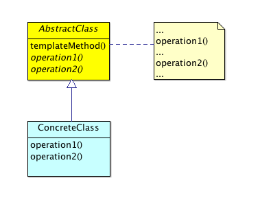

# Template Pattern

 

## Overview

The Template Method's intent is as follows: 

> Define the skeleton of an algorithm in an operation, deferring some steps to subclasses. Template Method lets subclasses redefine certain steps of an algorithm without changing the algorithm's structure—[Gang of Four][gof]

In the Template Method, we define an operation in a base class that has a particular sequence of "sub-operations". This sequencing of calls from the Template Method to these sub-operations is an invariant—in fact, the template method itself, is often marked _final_ so that it cannot be changed. 

## Hollywood Principle

The arrangement of having a Template Method in the base class that calls operations defined by sub-classes is an example of using the _Hollywood Principle_: "Don't call us, we'll call you."—an analogy drawn from how a typical casting call process works: A pool of talent shows up to audition for a _part_. Perhaps there's sign in table where the talent leaves a media package (e.g. head shots, credit list, contact information, etc.). They are told to go to a waiting room (where they possibly wait all day), but eventually, get a chance to perform their audition. _Casting directors_ watch, take notes, and likely make faces of disapproval. Later, through a process of elimination, the casting directors come up with a _casting list_. 

Once the talent has finished their audition, the casting director might say: "don't call us, we'll call you". This is, essentially, a dismissive way of saying "don't bother to pursue the part any further...we'll get a hold of you if we feel like it!". This analogy is similar to the arrangement we have in Template Method: Sub-classes do not call operations on the parent ("don't call us")—they may override operations and even implement hooks—but only the parent gets to decides if and when these overriden operations get called ("we'll call you!").

## Features

Template method provides the following benefits:

* The base class provides a single entry point for execution
* The base class has control of the sequence of performed operations for an algorithm
* Sub classes provide implementation details
* The base class may define _hook methods_ with empty implementations that lower-level classes can choose to override 

## Hooks

Hook methods allow lower level components to "hook in to" a system. High-level classes determine exactly at which point these hooks are called. They are generally defined with empty implementations so that, if not overriden, nothing happens when they're called. In fact (in this case), the real difference between the abstract and hook methods is that the former are required, the later optional.

## Participants

* **AbstractClass:** Defines the Template Method which will, in turn, call any of the following if defined:
	* **Concrete methods:** Generalized methods that provide any shared functionality
	* **Abstract methods:** Operations that sub-classes must override (required) 
	* **Hook methods:** Operations that sub-classes may override (optional)

## Implementation

The following is about the simplest implementation of Template Method you could find, but will help us to get a firm grasp of how this pattern works:

```java
abstract class AbstractClass {
	public abstract void operation1();
	public abstract void operation2();
	public void hook1() {}
	public void hook2() {}
	public final void templateMethod() {
		hook1();
		operation1();
		operation2();
		hook2();
	}
}
class ConcreteClass extends AbstractClass {
	private String className = this.getClass().getSimpleName();
	public void operation1() {
		System.out.println(className + ": operation1 called...");
	}
	public void operation2() {
		System.out.println(className + ": operation2 called...");
	}
	public void hook1() {
		System.out.println(className + ": hook1 called..."); 
	}
}
class ConcreteClass2 extends AbstractClass {
	private String className = this.getClass().getSimpleName();
	public void operation1() {
		System.out.println(className + ": operation1 called...");
	}
	public void operation2() {
		System.out.println(className + ": operation2 called...");
	}
	public void hook2() {
		System.out.println(className + ": hook2 called..."); 
	}
}

public class Template {
	public static void main(String[] args) {
		ConcreteClass cc1 = new ConcreteClass();
		cc1.templateMethod();
		ConcreteClass2 cc2 = new ConcreteClass2();
		cc2.templateMethod();
	}
}
```
Unsurprisingly, running this code prints out the following:

<pre><code>ConcreteClass: hook1 called...
ConcreteClass: operation1 called...
ConcreteClass: operation2 called...
ConcreteClass2: operation1 called...
ConcreteClass2: operation2 called...
ConcreteClass2: hook2 called...
</code></pre>

We define the abstract class with both abstract operations and concrete "hook" operations (notice the empty code blocks); it also has the _templateMethod_ which calls each of the aformentioned operations. Notice that the hooks will "no op" if not implemented by a particular sub-class. For example, the first ConcreteClass only implements _hook1_ (and we see that in the output), whereas ConcreteClass2	only implements _hook2_ (also reflected in the output).

## Example: Audio Decoder

Let's take a look at a slightly more interesting (albeit, still not "real world ready") example of implementing an Audio Decoder abstraction. We want to be able to handle both MP3's and AAC lossy audio formats, and have access to libraries that implement the low-level native details for each. We may want to support Ogg at a later date, and possibly even lossless formats too. Therefore, we need to comply with open/closed, and make sure that any classes we define don't have to later be "opened up".

First our tests:

```java

import static org.junit.Assert.*;

import org.junit.After;
import org.junit.Before;
import org.junit.Test;

//http://docs.mockito.googlecode.com/hg/org/mockito/Mockito.html
import static org.mockito.Mockito.*;

public class AudioDecoderTests {
	private INativeDecoder mockNativeMP3Decoder;
	private INativeDecoder mockNativeAACDecoder;
	
	@Before
	public void setUp() throws Exception {
		mockNativeMP3Decoder = mock(NativeMP3Decoder.class);
		mockNativeAACDecoder = mock(NativeAACDecoder.class);
	}

	@After
	public void tearDown() throws Exception {
		mockNativeMP3Decoder = null;
		mockNativeAACDecoder = null;
	}

	@Test
	public void testPlaysMP3s() {
		MP3Decoder mp3Decoder = new MP3Decoder(mockNativeMP3Decoder, "my_song.mp3");
		mp3Decoder.play();
		verify(mockNativeMP3Decoder, times(1)).decode(null);
	}

	@Test
	public void testPlaysAACs() {
		AACDecoder aacDecoder = new AACDecoder(mockNativeAACDecoder, "my_song.aac");
		aacDecoder.play();
		verify(mockNativeAACDecoder, times(1)).decode(null);
	}
}
```
And here's our partial implementation (we've decided to err on the side of brevity for this example as actually implementing an audio decoder might distract from this chapter's topic—the Template Method pattern):

```java

class AudioInputStream {}

public abstract class AudioDecoder {
	protected String filePath;
	protected INativeDecoder decoder;
	
	public AudioDecoder(INativeDecoder decoder, String pathToAudioFile) {
		this.filePath = pathToAudioFile;
		this.decoder = decoder;
	}
	public abstract AudioInputStream loadStream();
	public abstract void decode(AudioInputStream ais);
	
	// Hooks
	public void beforeDecode(){}
	public void afterDecode(){}
	
	public void play() {
		AudioInputStream ais = loadStream();
		beforeDecode();
		decode(ais);
		afterDecode();
	}
}

interface INativeDecoder {
	public void decode(AudioInputStream ais);
}

class NativeAACDecoder implements INativeDecoder {
	public void decode(AudioInputStream ais) {
		// ... complex decode implementation omitted
		System.out.println("NativeAACDecoder decoding audio stream...");
	}
}

class NativeMP3Decoder implements INativeDecoder {
	public void decode(AudioInputStream ais) {
		// ... complex decode implementation omitted
		System.out.println("NativeMP3Decoder decoding audio stream...");
	}
}

class AACDecoder extends AudioDecoder {
	
	public AACDecoder(INativeDecoder decoder, String pathToAudioFile) {
		super(decoder, pathToAudioFile);
	}

	@Override
	public AudioInputStream loadStream() {
		// ... complex code to load an AAC audio stream
		return null;
	}

	@Override
	public void decode(AudioInputStream ais) {
		this.decoder.decode(ais);
	}
	
	public void beforeDecode(){
		System.out.println("AAC staring...");
	}
	public void afterDecode(){
		System.out.println("AAC stopped...");
	}
}

class MP3Decoder extends AudioDecoder {

	public MP3Decoder(INativeDecoder decoder, String pathToAudioFile) {
		super(decoder, pathToAudioFile);
	}

	@Override
	public void decode(AudioInputStream ais) {
		this.decoder.decode(ais);
	}
	
	@Override
	public AudioInputStream loadStream() {
		// ... complex code to load an MP3 audio stream
		return null;
	}
	
	public void beforeDecode(){
		System.out.println("MP3 staring...");
	}
	public void afterDecode(){
		System.out.println("MP3 stopped...");
	}
}
```

The INativeDecoder related classes are not a part of Template Method pattern. However, they are convenient [DOC's][doc] that we mocked in our tests to confirm that the correct corresponding native implementations get called. For example, when we set up the MP3Decoder, we ensure that the _mockNativeMP3Decoder.decode_ method gets called.

_The astute reader may notice that our INativeDecoder's look as though they're being used almost like algorithms in the Strategy pattern (don't get confused...we're about to cover this pattern next!). That's sort of true, but realistically, these native audio API's would be much more complex, and also, since we don't control them, they're really not proper "strategy algorithms" per se._

## Exercises

**FeedReader:** Implement a FeedReader that works with Atom, RSS1, RSS2, etc., and create an abstract FeedParser interface and with concrete implementations for each. The _readFeeds_ will be the Template Method. You may use the following pseudocode to get started but feel free to "roll your own":

```java

abstract class FeedReader {
	public final ArrayList<Feed> readFeeds(String url) {
		// .. omitted
	}
	abstract String getFeedTitle();
	abstract String getFeedAuthor();
	abstract String getFeedContent();
	public void beforeFeedParsed() {}
	public void afterFeedParsed() {}
	// .. omitted
}

class AtomReader extends FeedReader { ...
	public void beforeFeedParsed() {
		// override...
	}
	public void afterFeedParsed() {
		// override...
	}
	abstract String getFeedTitle() {
		// gets title
	}
	abstract String getFeedAuthor() {
		// gets author
	}
	abstract String getFeedContent() {
		// gets content
	}
}
class RSS1Reader extends FeedReader { 
	//...
}
class RSS2Reader extends FeedReader {
	// ...
}

```

## Pitfalls

The following are some disadvantages to Template Method:

* **Class explosion:** As the needs of an application grows, you will be required to create new classes for each new behavior desired. This can lead to an explosion of template object
* **Understandability:** Since Template Method requires inheritance, it can become hard to reason about the various sub-classes involved
* **Superclass coupling:** As the super-class defines all involved operations, sub-classes are tightly couples to it 

## Summary

The Template Method pattern lets subclasses define certain steps of an algorithm while preserving the sequence of these steps. It is somewhat similar to the Strategy pattern, in that the implementation details of certain behaviors are encapsulated and interchangeable. However, the Template Method uses _inheritance_ to achieve its goals, whereas the Strategy uses _composition_. Template method also provides an opportunity to add hooks that clients can optionally implement. These hooks get called at certain points in the Template Method's run-time execution (e.g. beforeXXX, afterXXX, onXXX, etc.).

Let's look at a somewhat related pattern next...the Strategy Pattern.

