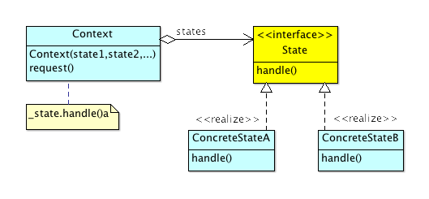
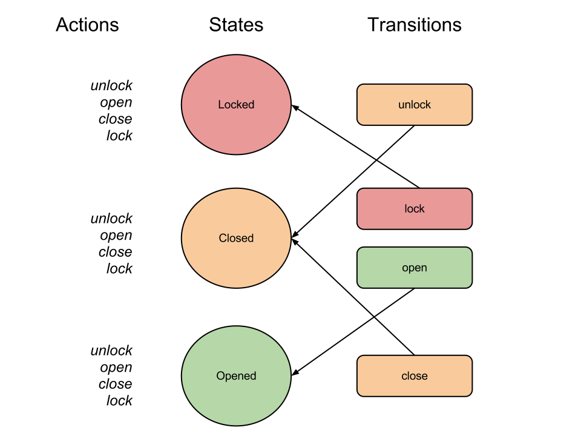

# State Pattern

## Overview

The State pattern allows us to:

> Allow an object to alter its behavior when its internal state changes. The object will appear to change its class.—[Gang of Four][gof]

The State pattern is a behavioral design pattern that, much like the Strategy pattern, uses composition to encapsulate behaviors that must change at run-time. However, unlike the Strategy pattern, these encapsulated behaviors (or actions) are dependent on a Context object's _current state_. When a certain action is requested of the Context, it simply delegates to its state reference, which takes care of determining how to best handle the request. That state will take in to account any rules for how it should respond to such a request. For example, if a door is in the "locked state", and the action requested is "open door", the appropriate result might be "entry denied" (whereas if the door is in the "closed state" (closed but unlocked), the same "open door" action might result in "door opened").

 

## Participants and Collaborations 

* **Context:** Delegates to _current state_ when requests are made
* **State:** Defines the interface for concrete state classes to implement
* **ConcreteState:** Implements functionality for a particular state

## Design Process 

 

The first step to putting this all together is to enumerate the states and actions for the system (transitions can be enumerated later in the process).

#### States

Enumerating the various states for our door example we come up with: 

* Opened
* Closed
* Locked 

#### Actions

The actions required for our door example might be:

* unlock door
* turn door knob
* push door open
* close door
* lock door
...and so on.

#### Putting it all together

Now that we've determined the _states_ and _actions_, we next need to determine the _transitions_ (and get a picture of how these interactions will work together). Using a pen and pad (or graphics program), we can take the following steps:

* create a three column diagram ordered with actions, states, and transitions
* under actions, list all the actions you'll need
* under the state column use circles to represent your states
* for each action for a given state, determine if successfully completing that action results in a transition to another state; if so, add a rectangle with the name of the action under your transitions column adjacent to the state the action took place in
* draw an arrow from the transition to the state it transitions to

This process will give a good first glance at how the states will evolve. We used this approach to create the figures in this chapter. 

## Case Study: Audio Application 


If you read the previous chapter on Strategy pattern, you may have noticed that we overlooked something when implementing the audio player—what happens if I hit play, but I'm already playing audio? Correspondingly, what happens if I hit pause, when not in the play mode? As we'll see, the State pattern handles these types of quandaries wonderfully.

### Implementation

For our tests, we need to test each action for each state to confirm that the behavior is correct. So in the Playing state we test that:

* **play:** does nothing
* **stop:** stops audio 
* **pause:** pauses audio 

And of course we need similar tests for our Stopped and Paused states. We won't show all the tests we came up with (see the book's repo for that), but here are the ones for just the Paused state:

```javascript
	describe("Paused", function() {
		it("should transition from paused to playing state",
		function() {
			var spyPausedPlay, spyLibPlay, player;

			spyPausedPlay = sinon.spy(paused, "play");
			spyLibPlay = sinon.spy(lib, "play");
			player = new AudioPlayer({	'playing': playing, 
										'paused': paused},
										'paused');
			player.playAudio();
			assert(spyPausedPlay.called);
			assert(spyLibPlay.called);
			assert(player.getState()['name'] === 'Playing');
			spyPausedPlay.restore();
		});
		it("should transition from paused to stopped state",
		function() {
			var spyPausedStop, spyLibStop, player;

			spyPausedStop = sinon.spy(paused, "stop");
			spyLibStop = sinon.spy(lib, "stop");
			player = new AudioPlayer({	'playing': playing, 
										'stopped': stopped,
										'paused': paused},
										'paused');
			player.stopAudio();
			assert(spyPausedStop.called);
			assert(spyLibStop.called);
			assert(player.getState()['name'] === 'Stopped');
			spyPausedStop.restore();
		});
		it("should not pause if already paused",
		function() {
			var spyPausePause, spyLibPause, player;

			spyPausePause = sinon.spy(paused, "pause");
			spyLibPause = sinon.spy(lib, "pause");
			player = new AudioPlayer({	'playing': playing, 
										'stopped': stopped,
										'paused': paused},
										'paused');
			player.pauseAudio();
			assert(!spyLibPause.called);
			assert(player.getState()['name'] === 'Paused');
			spyPausePause.restore();
		});	
	});
```

_As we've mentioned in an earlier disclaimer, our test and production code are "overly optimistic" as we don't test for bad inputs, etc. Again, we've purposely sacrificed robustness for more understandable code. In practice, we'd aim for much more thorough code!_

The flow of the three tests are quite similar (with the last one simply negating that audio will be paused if already in the paused state):

* We create two test spies: One that corresponds with the low-level underlying audio library that is carrying out _play_, _pause_, and _stop_; and the other that corresponds to our ConcreteState's action (e.g. the Paused state's _play_ method, etc.). With these two spies, we can simply assert whether or not they got called as appropriate.
* We instantiate the AudioPlayer (our Context) injecting a map of our instantiated states as our first argument, and the key to the initial state as our second argument. Arranging the initialization of these objects outside of the AudioPlayer's constructor makes it easy to create test doubles with state appropriate for that particular test case's needs.
* Once we have the above set up, we call the production method on the AudioPlayer (e.g. player.pauseAudio, etc.), and then assert that our spies got called as expected. 
* The last line of each test restores the spied on method to its original state. Sinon.js, essentially, hijacks these spy methods by intercepting any calls and then proxying to the original. 

_These restore calls weren't actually necessary for the above tests (we're nulling out these objects in our teardown and re-creating them in subsequent setup methods), but we've left them in to show how this is done. For example, we would need to do restore if the spy pointed to the jQuery.ajax method (since jQuery is really a one time globally loaded lib)._

Here's our Audio State implementation:

```javascript
// 3rd Party Lib
var AudioLib = function() {};
AudioLib.prototype = {
	play: function() {
		console.log('Playing audio...');
	},
	pause: function() {
		console.log('Pausing audio...');
	},
	stop: function() {
		console.log('Stopping audio...');
	}
};

// Context
var AudioPlayer = function(states, initialState) {
	this.states = states;
	this.currentState = states[initialState];
};
AudioPlayer.prototype = {
	playAudio: function() {
		this.currentState.play(this);
	},
	pauseAudio: function() {
		this.currentState.pause(this);
	},
	stopAudio: function() {
		this.currentState.stop(this);
	},
	getState: function() {
		return this.currentState;
	},
	setState: function(newState) {
		this.currentState = this.states[newState];
	}
};

// State
var IState = function(name) {
	this.name = name;
};
IState.prototype = {
	play: function(context) {
		throw new Error("Method must be implemented."); 
	},
	pause: function(context) {
		throw new Error("Method must be implemented."); 
	},
	stop: function(context) {
		throw new Error("Method must be implemented."); 
	}
};

// Concrete States
var Playing = function(name, audioLib) {
	this.name = name;
	this.audioLib = audioLib;
};
Playing.prototype = new IState(); 
Playing.prototype = {
	play: function(context) {
		console.log("Already playing ... nothing to do...");
	},
	pause: function(context) {
		this.audioLib.pause();
		context.setState('paused');
	},
	stop: function(context) {
		this.audioLib.stop();
		context.setState('stopped');
	}
};

var Paused = function(name, audioLib) {
	this.name = name;
	this.audioLib = audioLib;
};
Paused.prototype = new IState(); 
Paused.prototype = {
	play: function(context) {
		this.audioLib.play();
		context.setState('playing');
	},
	pause: function(context) {
		console.log("Already paused ... nothing to do");
	},
	stop: function(context) {
		this.audioLib.stop();
		context.setState('stopped');
	}
};

var Stopped = function(name, audioLib) {
	this.name = name;
	this.audioLib = audioLib;
};
Stopped.prototype = new IState(); 
Stopped.prototype = {
	play: function(context) {
		this.audioLib.play();
		context.setState('playing');
	},
	pause: function(context) {
		console.log("Can't pause when stopped...");
	},
	stop: function(context) {
		console.log("Already stopped... nothing to do");
	}
};

module.exports.IState = IState;
module.exports.AudioPlayer = AudioPlayer;
module.exports.AudioLib = AudioLib;
module.exports.Playing = Playing;
module.exports.Paused = Paused;
module.exports.Stopped = Stopped;
```

AudioLib is an imaginary library for doing the low-level audio work. As can be seen from the above code, our State's implement all of the possible actions we've accounted for. 

Essentially, one of three things can happen for a given action method: 1) the corresonding action is carried out 2) same as 1 but a transition to a new state is initiated 3) the method "no ops" (does nothing). In our system only 2 and 3 ever happen, but a more complicated system will have all three.

Since these action handlers are just methods, the implementer is free to put in whatever logic is required. This makes the State pattern particularly flexible (but also prone to too much complexity if a disciplined approach is not used).

As there's always some flexibility in how we use a design pattern, we could have chosen to use an abstract intermediary class creating empty "no op" methods there, so that ConcreteState implementations only had to implement methods they care about. We'll opt out of digressing in to how that might be implemented, but bring it up in case you're bothered by the "no ops" above.

If you compare the above implementation to our Strategy one, you may be wondering if we've "lost out" since we now only have the one AudioLib (recall in our Strategy example we had HTML5, Flash, etc., audio implementations); with a bit of ingenuity we couldn certainly pass in various types of audio libraries at run-time if we wanted. We could even mix in Strategy and State (as design patterns are just guidelines to help us tackle problems. Using such _compound patterns_ is quite common in practice.).

## Other Use Cases

* **Sales Order:** One classic example is a sales order that has discrete states like "New order", "Dispatched", "Shipped", "Cancelled", "Billed", and so on.
* **Transactions:** Imagine a transaction that can be in the states: "not_in_transaction", "in_transaction", "commited", "rolled_back", etc.
* **Graphics Tool:** A simple paint tool might be able take on states like: "blur", "erase", "smudge", "line", "arrow", etc., and draw accordingly.
* **Intern to employee:** Perhaps a company has states for their employees straight out of school. To become a "full blown employee" from intern that have to go through: "gopher", "intern", "skilled_helper", "appreciated_apprentice", etc. Perhaps the salary the intern is paid changes based on these levels. Further, perhaps, they must go through each level in sequence (you can't jump from "gopher" to "appreciated_apprentice" for example).
* **Vending machine:** Another classic example with states like "waiting", "coin_in", "beverage_sent", "coin_returned", etc. 

## Exercises

Implement one or more of the above example use cases.

## Benefits

* Replaces long if or switch statements with encapsulated classes representing each state ([DRY][dry])
* Gets rid of duplicate branching (related to first bullet point)
* The encapsulated classes increase cohesion in the system
* uses composition so we're programming to an interface
* Since the Context simply delegates to State classes more can be added as needed as long as they conform to the State interface

## Issues

* Increases complexity and might cause State class explosion
* Since States are generally in charge of initiating transitions, they become coupled to the state(s) they transition to. However, it could be argued that this structured program flow is really more of a benefit than a burden

## Summary 

The state pattern can be a helpful way to model problems that involve discrete states and actions that would typically require duplicate conditional logic throughout a code base. It's a good example of using compositional delegation and programming to an interface. A well implemented state design can increase understandability since the states, actions, and transitions all relate very closely to the domain being modelled.


